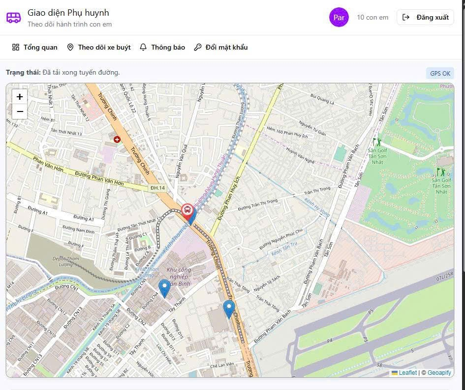
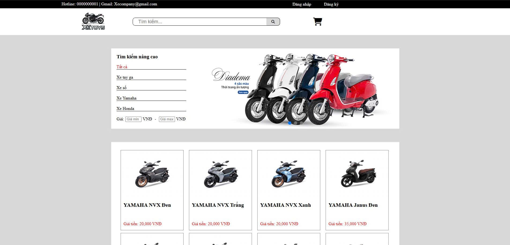
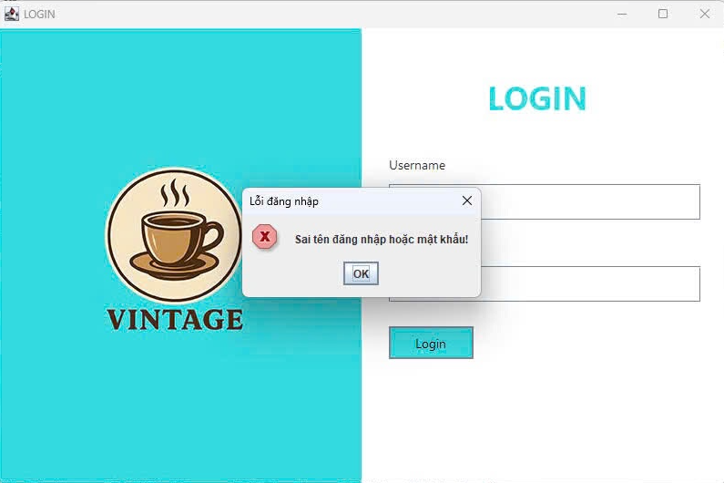

# Anh Tuấn Portfolio
---

Hi, I'm **Huỳnh Lê Anh Tuấn**, a Software Developer passionate about building web applications and solving real-world problems with code.

---

# Projects

## Smart Bus Tracking System

A web-based system designed to help passengers easily track bus routes and schedules in real time. The system allows users to view bus locations on a map, check estimated arrival times, and search for bus routes between different stops.

The platform also provides useful information such as route details, bus stops, and operating schedules, helping passengers plan their trips more efficiently.

**Key Features**
- Real-time bus location tracking
- Bus route and stop information
- Search for routes and schedules
- User-friendly web interface

**Technologies**
- React, ExpressJS
- MySQL
- HTML / CSS / JavaScript

---

## Minesweeper Game (Python)

A simple implementation of the classic Minesweeper game using Python and Pygame.

**Technologies**
- Python
- Pygame

Features:
- Grid generation
- Bomb detection
- Game UI

---

## Motorbike Sales Website

An e-commerce website for browsing and purchasing motorbikes online.

**Features**
- Product browsing
- Shopping cart
- Order management
- User authentication

**Technologies**
- HTML/CSS/JS

---

## Café Management System

A desktop application used to manage orders, employees, products and invoices in a coffee shop.

**Technologies**
- Java Swing
- MySQL

**Features**
- Manage orders
- Manage products
- Employee management
- Revenue tracking

---

# Skills

**Programming Languages**
- Java
- C#
- Python
- JavaScript
- PHP

**Technologies**
- ASP.NET
- MySQL, SQLServer
- ExpressJS, React
- Git
- Bootstrap
- Latex

---

# Contact

📧 Email: hlatuan0793@gmail.com  
💼 GitHub: https://github.com/tuanPeo27  
🌐 Portfolio: https://tuanpeo27.github.io/

---

© 2026 Anh Tuấn
