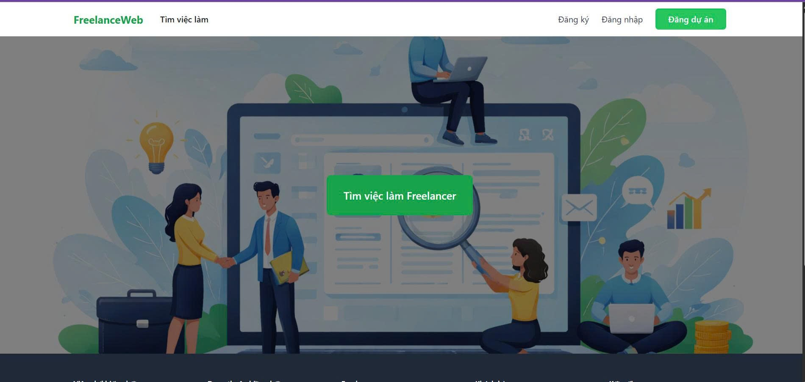

# Anh Tuấn Portfolio
---

Hi, I'm **Huỳnh Lê Anh Tuấn**, a Software Developer passionate about building web applications and solving real-world problems with code.

---

# Projects

## SmartDoc AI - Intelligent Document Q&A System

A document-based question answering system built using Retrieval-Augmented Generation (RAG) architecture. The system allows users to upload documents and ask questions, and it generates accurate answers by retrieving relevant information from the documents and combining it with responses from a Large Language Model.

The application processes documents by splitting them into smaller chunks, converting them into vector embeddings, and storing them in a vector database for efficient similarity search. When a user submits a query, the system retrieves the most relevant document segments and provides them as context for the language model to generate precise answers.

The system integrates modern AI technologies such as LangChain, FAISS, and LLMs running locally through Ollama, enabling efficient document retrieval and intelligent responses.

**Key Features**

- Upload and process documents (PDF / text files)
- Automatic text chunking and embedding generation
- Vector similarity search using FAISS
- Retrieval-Augmented Generation (RAG) pipeline
- Question answering based on uploaded documents
- Interactive user interface for document search and chat
- Error handling and query validation

**Technologies**

- Python
- LangChain
- FAISS (Vector Database)
- Ollama
- Qwen2.5 LLM
- Streamlit / Web UI
- Document processing libraries (PyPDF, etc.)

<!-- 

 -->

## Freelance Web

A web-based platform developed to connect clients with freelancers, allowing users to post projects, browse available services, and collaborate efficiently. The system provides an intuitive interface for managing freelance jobs, tracking project progress, and facilitating communication between clients and freelancers.

Users can create accounts, post job requirements, submit proposals, and manage project details in one centralized platform. The application helps streamline the freelance workflow and improve collaboration between both parties.

**Key Features**
- User authentication and role management (client / freelancer)
- Post and manage freelance projects
- Submit proposals and manage project applications
- Project tracking and management
- Responsive and user-friendly web interface

**Technologies**
- Laravel (PHP Framework)
- MySQL
- Blade Template
- HTML / CSS / JavaScript

## Smart Bus Tracking System

A web-based system designed to help passengers easily track bus routes and schedules in real time. The system allows users to view bus locations on a map, check estimated arrival times, and search for bus routes between different stops.

The platform also provides useful information such as route details, bus stops, and operating schedules, helping passengers plan their trips more efficiently.

**Key Features**
- Real-time bus location tracking
- Bus route and stop information
- Search for routes and schedules
- User-friendly web interface

**Technologies**
- React, ExpressJS
- MySQL
- HTML / CSS / JavaScript

---

## Minesweeper Game (Python)

A simple implementation of the classic Minesweeper game using Python and Pygame.

**Technologies**
- Python
- Pygame

Features:
- Grid generation
- Bomb detection
- Game UI

---
## Café Management System

A desktop application used to manage orders, employees, products and invoices in a coffee shop.

**Technologies**
- Java Swing
- MySQL

**Features**
- Manage orders
- Manage products
- Employee management
- Revenue tracking

---

## Motorbike Sales Website

An e-commerce website for browsing and purchasing motorbikes online.

**Features**
- Product browsing
- Shopping cart
- Order management
- User authentication

**Technologies**
- HTML/CSS/JS

---

# Skills

**Programming Languages**
- Java
- C#
- Python
- JavaScript
- PHP   

**Technologies**
- ASP.NET
- MySQL, SQLServer
- ExpressJS, React
- Git
- Bootstrap
- Latex

---

# Contact

📧 Email: hlatuan0793@gmail.com  
💼 GitHub: https://github.com/tuanPeo27  
🌐 Portfolio: https://tuanpeo27.github.io/

---

© 2026 Anh Tuấn
